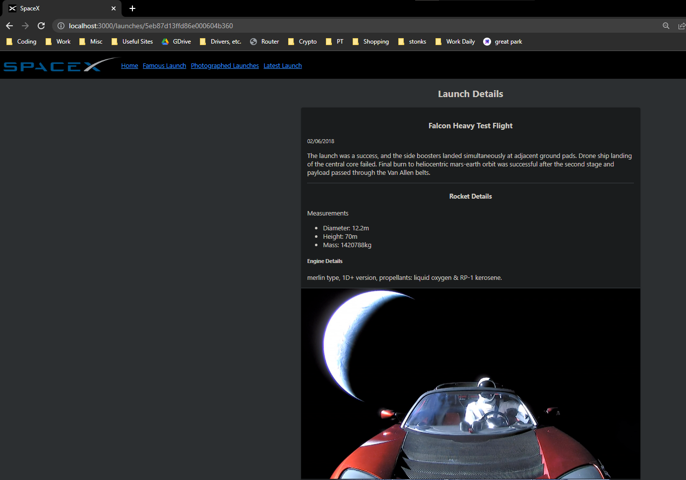

# Example React Project Structure

- This example is not using any styled component libraries or much css to keep the example simple.
- JSDoc comments are used as an example of how to document and improve autocomplete, but it is limited compared to typescript.
- The benefits of taking more time up-front to structure an app this way are not immediately clear when your app is small, however, when your app grows, it becomes very helpful to have followed this or other organized structures.

---

## Opinionated

- `create-react-app` (CRA) is not very opinionated, it's up to you largely to decide how to structure your project. The pro is that this is flexible and it stays out of your way, the con is you may tie yourself into a disorganized knot and your team may not have a clear idea of how to structure things.
- This is an opinionated example of how to structure a CRA, there are other ways that work well.
- `next.js` is a popular example of a more opinionated react app template. Besides it adding a lot of great functionality, it is highly opinionated about how to structure the project so you don't have to come up with as much on your own, `next.js` has already come up with an opinionated structure that many have found to be good. This also has the benefit that many companies that use `next.js` follow it's opinionated structure, so switching companies doesn't come with as much change in project structure.

---

## Absolute Path Imports

- To avoid relative path hell, such as `../../../../foo/bar`, absolute imports have been enabled via [jsonconfig.json](./jsconfig.json) so that imports start at the `src` folder.
- This means regardless of how nested you are, your imports can be written the same.
- However, when a file imports a file that is in the same folder, relative imports are typically still used since it is clean and easy to do so: `./my-neighbor.js`.

---

## Structure Explained

- [File Structure Blog Post](https://www.joshwcomeau.com/react/file-structure/)

### Import / Export

#### `index` Pattern

- This organization pattern is not specific to react, it can be used in other node apps.
- The `index` file in each folder clarifies what code in the folder is supposed to be available outside of the folder. Some files may be used only internally in the folder by other files within, whereas some files are meant to be imported from outside of the folder--these are the ones the `index` exports.
- This pattern also allows you to refer to the **folder name** when importing, which will automatically look for an `index` file, reducing the length of import statement and naming repetition (`from 'components/Button/Button'` vs `from 'components/Button`).
- The `index` can also be used to `export` code from multiple files in the folder so a single `import` statement can import everything needed from that folder.
- **Downside**: The downside of this is when you make each component an `index` file and you open multiple components, all the tabs in VSCode are named `index`. The tabs then become wider to show the folder name so they can be differentiated which leaves less space for more tabs. A solution is discussed in the above linked blog post: to write the component in a file named after the component / its folder, and then ***also*** make an `index` file that exports it so the benefits of both can be had. However, this requires creating an extra file.

#### Named Exports

- The `default` keyword is avoided in favor of named exports to simplify by using one syntax instead of sometimes using `default` and sometimes using named exports.
- Named exports require you to use the same name when you import which increases consistency.
- However, plenty of large and successful projects use `default` exports.

#### Import Ordering

- `import`s should be at the top of the file and start with third party imports (installed packages) and then local imports (your own files) should be below.
- It's also common to alphabetize named imports: `import { a, b, c, d } from 'foo'`

### Environment Configurations

- The [.env](./.env) file is usually ignored (it's included here as an example). This is where you store configuration info that may change between environments, such as a port, URLs, API keys, or other kinds of credentials.
- See [apiSpaceX file](./src/services/apiSpaceX.js)

### Folders

- In some folders, it is less common to use an `index` file, such as the `utils` or `services` folder.

#### [components](./src/components/)

- Each component itself is a folder so that files related to only that component can be grouped with that component directly by placing them in the folder; such as test files that test the component, child components / hooks / helper files used only for this component, and `css` modules.
  - Even when you only have 1 file to start with, it still often is a good idea to make a folder so it's easy to add related files later as the need arises without having to change your imports.
  - To keep this example simple, no styling libraries are used. For a larger project, I recommend using a styled component library that is popular in the industry (such as MUI and Chakra) over only `css` modules.
- Components do not represent a full page, we call those components a view / page, so they go in the [views](./src/views) folder. Views have urls that route to the view while components represent smaller parts of views / pages, such as a navbar, a navbar is not an entire page, only part of one.

#### [services](./src/services)

- Services are not specific to react, they are also commonly used in MVC structures to keep controllers skinny and focused on handling the `request` and `response` rather than logic and interaction with the DB, which is moved into a service and then can be re-used in multiple routes if needed.
- Generally a service file is used to store functions that make API requests so that these requests and any logic that needs to happen each time the request is made can be shared.
- This also avoids the need to repeat the URL for the request in multiple components, import `axios` into multiple components, or import the URLs into multiple components.

#### [utils](./src/utils)

- Reusable functions that don't need to be components but may be used by multiple components.
- `utils` and `helpers` are often used synonymously, however, some people make the distinction that helpers are specific to the project and utils are not--utils can be copied from one project into another in this case, while helpers couldn't be.

#### [assets](./src/assets)

- Any files the app needs at runtime (files that need to be imported into `js` files in `src`), such as images, fonts, sounds, etc.

---

## Additional Resources

### Group Collaboration

- [Git Branching Cheatsheet](https://docs.google.com/document/d/1lMPkGE6j0JhF6LX_-afnoSMOvCIVueGpFfkHo23_YU0/edit?usp=sharing)
- A formatter and linter should be installed, such as `prettier` and `ESLint` and a [pre-commit hook](https://prettier.io/docs/en/precommit.html#option-2-pretty-quickhttpsgithubcomazzpretty-quick) which auto formats the code by the project's formatter's config on each `git commit` to standardize formatting across all collaborators.
